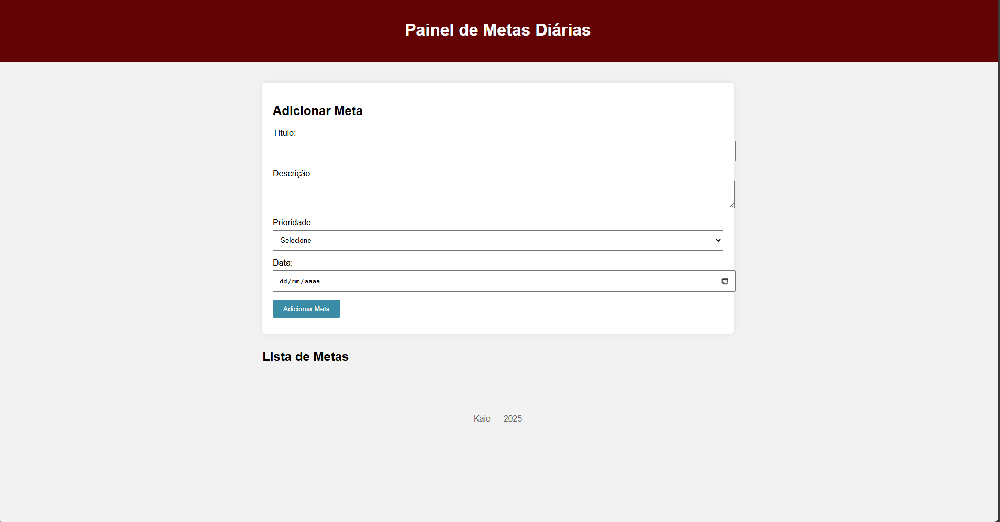

# Painel de Metas
## 💡Projeto sobre o funcionamento de metas diárias para a organização pessoal.

---

## 📝Objetivo do Projeto
O projeto é um site sobre metas diárias, onde o usuário pode digitar uma meta que deseja realizar no dia, podendo também removê-la ou marcá-la como concluída. Ele serve como uma forma de organizar o cotidiano.

---

## 🎯Para quem é?
Feito de aluno para a aluno.

## Captura de Tela

---
## 🛠️ Melhorias Futuras
- Melhoria responsiva
- Organização por topicos para as metas
- Modo escuro para melhor visualização
- Estetica moderna

---

### 📝Funcionalidades
- Adicionar Metas
- Remover Metas
- Concluir Metas
- Prioridade de Meta
- Data escolhida para a realização da meta
---

## ⚙️Tecnologia Usadas

- </>HTML5
- 🎨CSS3
- ♨️JavaScript (ES6+)
- 🆚VS Code
- 👩🏻‍💻Git e GitHub
- 🌐Navegador Google Chrome (para testes)

## 👤Autor
Kaio

